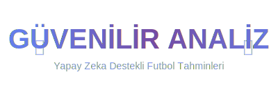

# ⚽ Güvenilir Analiz



## 🎯 Proje Hakkında

**Güvenilir Analiz**, yapay zeka ve gelişmiş istatistiksel modelleme teknikleri kullanarak futbol maçlarının sonuçlarını tahmin eden profesyonel bir web uygulamasıdır.

### ✨ Özellikler

- 🤖 **Yapay Zeka Destekli Tahminler**: Poisson dağılımı ve Elo rating sistemi ile güçlendirilmiş tahmin motoru
- 📊 **Gerçek Zamanlı Veriler**: API-Football üzerinden canlı maç verileri
- 🎯 **Detaylı Analiz**: 
  - 1X2 tahminleri
  - 2.5 gol üstü/altı
  - Karşılıklı gol (BTTS)
  - Korner tahminleri
  - Sarı/Kırmızı kart analizleri
  - İlk yarı tahminleri
  - Handikap analizleri
- 📈 **İstatistiksel Göstergeler**: 
  - Form analizi
  - H2H geçmişi
  - Hakem istatistikleri
  - Sakatlık/ceza bilgileri
- 💎 **Kullanıcı Yönetimi**: Ücretsiz ve ücretli üyelik seviyeleri
- 🔐 **Admin Paneli**: Kapsamlı yönetim özellikleri
- ⭐ **Favori Ligler**: Kişiselleştirilmiş lig takibi
- 🌐 **IP Kısıtlama**: Hesap güvenliği için IP bazlı erişim kontrolü

### 🎨 Tasarım Özellikleri

- **Modern UI/UX**: Gradient renkler ve profesyonel tasarım
- **Responsive**: Tüm cihazlarda sorunsuz çalışır
- **Özel Logo**: Futbol ve AI temalarını birleştiren benzersiz logo
- **Karanlık Tema**: Göz yormayan arayüz

### 🛠️ Teknolojiler

- **Frontend**: Streamlit
- **Backend**: Python 3.x
- **API**: API-Football
- **Veritabanı**: YAML/JSON dosya sistemi
- **AI/ML**: Poisson Distribution, Elo Rating System
- **Güvenlik**: Streamlit Authenticator, bcrypt hashing

### 📦 Kurulum

1. Repoyu klonlayın:
```bash
git clone https://github.com/sivriabbas/yenianaliz.git
cd yenianaliz
```

2. Gerekli paketleri yükleyin:
```bash
pip install -r requirements.txt
```

3. `.streamlit/secrets.toml` dosyası oluşturun:
```toml
API_KEY = "your_api_football_key"
```

4. Uygulamayı çalıştırın:
```bash
streamlit run app.py
```

### 🔑 API Key

API-Football'dan ücretsiz API anahtarı alabilirsiniz:
https://www.api-football.com/

### 👥 Kullanıcı Yönetimi

Kullanıcı eklemek için:
```bash
python password_manager.py add --username <kullanici> --email <email> --name <ad> --password <sifre> --tier <ücretsiz/ücretli>
```

### 🎯 Kullanım

1. **Ana Sayfa**: Hızlı takım arama
2. **Maç Panosu**: Tarih ve lig bazlı toplu analiz
3. **Manuel Analiz**: Özel maç analizleri ve favori ligler

### 📊 Admin Paneli

Admin kullanıcılar için özel özellikler:
- Kullanıcı yönetimi (ekleme, silme, şifre sıfırlama)
- IP kısıtlama yönetimi
- Kullanım istatistikleri
- Sistem ayarları
- Admin yetkilendirme

### 🔒 Güvenlik

- Bcrypt şifre hash'leme
- IP bazlı erişim kontrolü
- Session yönetimi
- API limit kontrolü

## 🚀 Canlı Demo

**Uygulamaya buradan erişebilirsiniz:** [Güvenilir Analiz](https://www.güvenlianaliz.com)

### 🌐 Deployment

Bu proje **Streamlit Community Cloud**'da barındırılmaktadır. 

Kendi deploymentınızı yapmak için [`STREAMLIT_DEPLOYMENT.md`](STREAMLIT_DEPLOYMENT.md) dosyasını inceleyin.

### 📝 Lisans

Bu proje özel bir projedir. Kullanım için izin gereklidir.

### 👨‍💻 Geliştirici

**Mustafa Yılmaz** - [sivriabbas](https://github.com/sivriabbas)

### 🤝 Katkıda Bulunma

Bu proje aktif olarak geliştirilmektedir. Önerileriniz için issue açabilirsiniz.

### 📞 İletişim

Sorularınız için: sivrii1940@gmail.com

---

⚽ **Güvenilir Analiz** - Yapay Zeka ile Futbolun Geleceği
